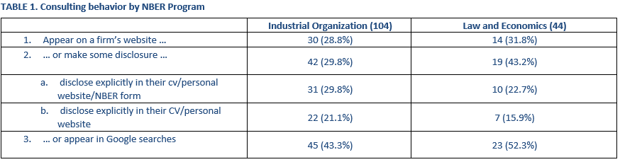
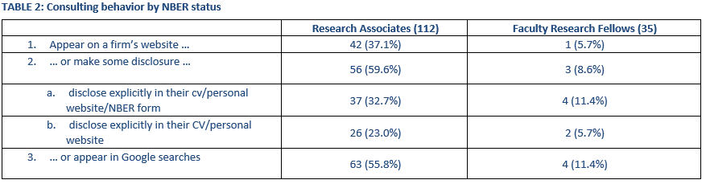
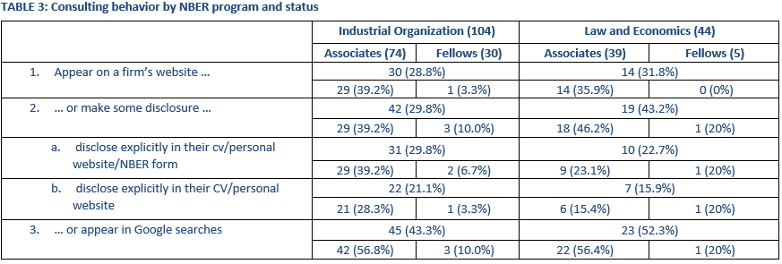

# Methodology

Below is the methodology used to determine identify the share of leading Industrial Organization scholars who consult/engage in expert litigation. Please note that this is both an incomplete sample and an imperfect methodology. This process is supposed to emulate a "back-of-the-napkin" calculation.

## The Sample
We consider all economists affiliated with either the [Industrial Organization](https://www.nber.org/affiliated-scholars?facet=user_programs%3AIndustrial%20Organization&page=1&perPage=50&sortBy=alpha#listing-2019022) or [Law and Economics](https://www.nber.org/affiliated-scholars?facet=user_programs%3ALaw%20and%20Economics&page=1&perPage=50&sortBy=alpha#listing-2019022) programs of the National Bureau of Economic Research. These programs do not identify as affiliates even all leading scholars (even if they are NBER affiliates generally) but they serve as non-arbitrary, consistent samples.

The IO program numbers 104 affiliated scholars. The Law and Economics program numbers 44. Note that Joel Waldfogel is an affiliated scholar for both programs and is thus twice-counted. So, the dataset contains 148 observations but 147 economists.

## Collection Methodology
The following outlines the methodology of collection by column of the spreadsheets `nber_affiliates_disclosure.csv`. Please consider the sheet titled "Computation".

**name**
- The name is copied as it appears on the NBER's scholar page. (See [Zach Y. Brown](https://www.nber.org/people/zach_brown?page=1&perPage=50), for example)
- This includes middle initials etc.
- NB. The exception to this is the use of accents. Accents are removed.

**nber_link**
- The link to the scholars NBER web page

**nber_program**
- The program of interest which the scholar is affiliated with. Note that many scholars are associated with many programs but not all programs are listed.

**personal_website_link**
- A link to the scholar's personal wesbite.
- Generally, this is collected by following the link available on the NBER's scholar page. However, in some instances this link points to a University/Department faculty page. In some instances this faculty page is as up-to-date as their personal website (which is often linked to from the faculty page).
- In either instance, whichever appears to be more recent is the website link listed.

**current_university_affiliation**
- The scholar's university affiliation. Wherever possible I try to identify the primary department appointment for scholars who have cross- or courtesy-appointments with multiple departments.
- Note that if only a university name is listed then this implies the economics department of that university (E.g. University of California, Berkeley). If a colon appears after the university name, what follows is usually a particular school/division (E.g. University of California, Berkeley: Haas). 

**[consutling firm's name here]** 
- We begin by identifying seven major economic consulting firms. These are Compass Lexecon, NERA Economic Consulting, Analysis Group, Charles River Associates, Berkeley Research Group, Bates White, and Cornerstone Research.
- Each of these firms gives academics who consult with/for them a different title. They are generally referred to as "academic affiliate," "consultant," "experts," etc:
    - [Compass Lexecon](https://www.compasslexecon.com/all-professionals/)
    - [NERA](https://www.nera.com/experts.html?size=n_24_n)
    - [Analysis Group](https://www.analysisgroup.com/experts-and-consultants/)
    - [Charles River Associates](https://www.crai.com/our-people/?page=1&sort=role)
    - [Berkeley Research Group](https://www.thinkbrg.com/)
    - [Bates White](https://www.bateswhite.com/people.html)
    - [Cornerstone Research](https://www.cornerstone.com/experts/)
- A scholar is coded as "1" if *any* evidence is available that they *ever* consulted for the firm of interest.
    - Some scholars consult concurrently with multiple firms and other consult sequentially with multiple firms. So, some scholars do not necessarily appear on a firm's website. 
    - I determine if a scholar has an affiliation with a firm by examining CVs, press releases, Google search results, and the firms' own websites.

**cv_disclosure**
- A scholar is coded as "1" if their CV discloses engaging in some form of economic consulting/litigation.
    - Some scholars only note their affiliation with an economic consulting firm. Others identify cases in which they served as an expert witness. I consider *any* form of disclosure as adequate to be coded as "1".
    - Many scholars engage in some kind of consulting work that does not necessarily involve one of these consulting firms/litigation. For example, Matthew Backus has consulted directly for eBay on eBay-related questions. However, there is no evidence he has consulted for eBay on legal- or litigation-related matters. Thus, he is **not** as "1".
- Scholar CVs are collected from their personal websites and saved locally.
    - The filename used when saved locally indicates the scholar (with a name that may differ slightly from their NBER name as middle initials etc. are dropped) and the date of *download* (E.g. `aaron_chalfin_05_23_2022.pdf` was download on May 23rd, 2022).
    - The date is noted because it may be possible that the author updates their CV between time of collection and the present.
    - Note that some CVs are considerably out of date. However, the most recent, available CV is used.

**google_search**
- A scholar is coded as "1" if a Google search returns results that suggest that they engage in some form of economic consulting/litigation.
- Google search queries are constructed as "[first name] [last name] expert witness".
    - Any deviations from this are noted in the **notes** column. Deviations are made in the case that the name is sufficiently generic that the pro form query does not even sufficiently identify the scholar of interest or when a single story/case dominates all search results (potentially obfuscating other consulting work)
    - The first three pages of results are considered.
- Google search results that I consider adequate to code a scholar as having consulted include press releases issued by/about the consulting firms, court documents identifying the scholar as an expert witness, or other firm-websites (including but not limited to the firms explicitly noted above). 

**notes** 
- Any notes about search methodology or explaining results are listed in this column.

**nber_web_disclosure**
- Using a prior dataset of NBER working papers collected by web-scraping, I identify whether scholars disclose consulting/potential conflicts of interest in their research publications. If they disclose an consulting/expert witness engagements in *any* of their papers, they are coded as "1".
    - The NBER's paper-level pages provide the authors with a section called "Acknowledgements and Disclosures." This is the field used to determine whether scholars disclose.
    - Considering this field is imperfect. Scholars might also make additional disclosures in the thanks/first footnote of the working paper itself. However, considering within-paper disclosure becomes considerably more difficult because of requirements for OCR-ing .PDF files.
- I code a scholar as "1" if any one of their papers makes a disclosure because it is not always clear when a scholar began consulting. That is, it is natural that scholars do not disclose consulting *before* they begin consulting.
    - This is a very generous measure of disclosure.

**nber_web_disclosure_notes**
- Any notes about what is disclosed in the prior column NBER acknowledgements and disclosures section is noted here.

**consults_at_all**
- If any one of the **[firm name]**, **cv_disclosure**, **google_search**, or **nber_web_disclosure** columns is coded as "1", this column is coded as "1".

**appears_on_firm_website**
- If the scholar appears on a firm's website, then this column is coded as "1".
    - Note that this is not the same as the union of the **[firm name]** columns as some of those columns are coded as 1 even if the scholar no longer appears on the website. The scholar might have formerly consulted for that firm, for example.

**discloses_cv_nber**
- If any one of the **cv_disclosure** or **nber_web_disclosure** columns is coded as "1", this column is coded as "1".

**firm_website_or_cv_nber**
- If any one of the **appears_on_firm_website** or **discloses_cv_nber** columns is coded as "1", this column is coded as "1".

## Additional Notes 

### 05/31/2022
In a series of 05/27 emails to Filippo Lancieri and Luigi Zingales I construct three tables summarizing this dataset (see below).

In Table 1, Row 1 corresponds to Excel column S; Row 2. to column U; 2a. to T; 2b. to M; and 3. to R (sheets IO and Law and Econ).In Tables 2 and 3, Row 1 corresponds to Excel column T; Row 2. to column V; 2a. to U; 2b. to N; and 3. to S.